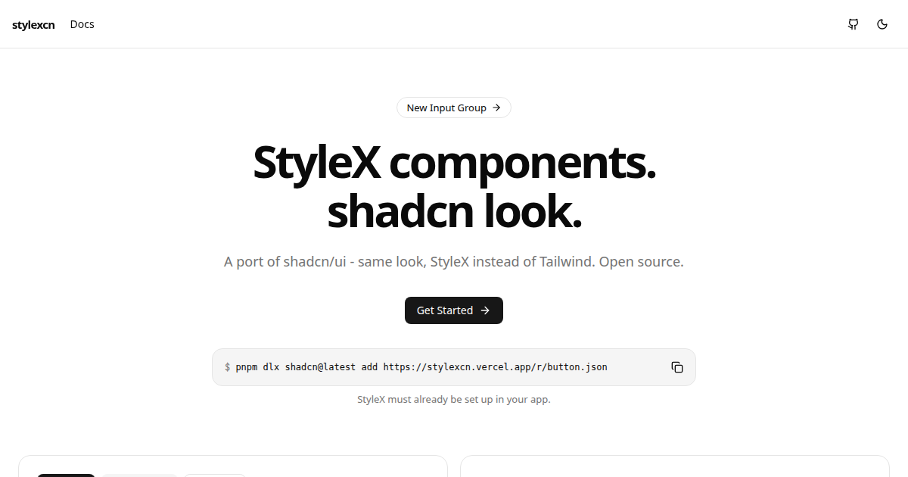

# stylexcn

StyleX components. shadcn look. A port of [shadcn/ui](https://ui.shadcn.com) using [StyleX](https://stylexjs.com) and Neutral tokens instead of Tailwind. Open Source. Open Code. Copy the code into your app.



## Documentation

Visit https://stylexcn.vercel.app/docs to view the documentation.

## Usage

```bash
pnpm dlx shadcn@latest add https://stylexcn.vercel.app/r/button.json
```

```bash
pnpm dlx shadcn@latest add @stylexcn/button
```

StyleX must already be set up. See the [documentation](https://stylexcn.vercel.app/docs) for the rest.
