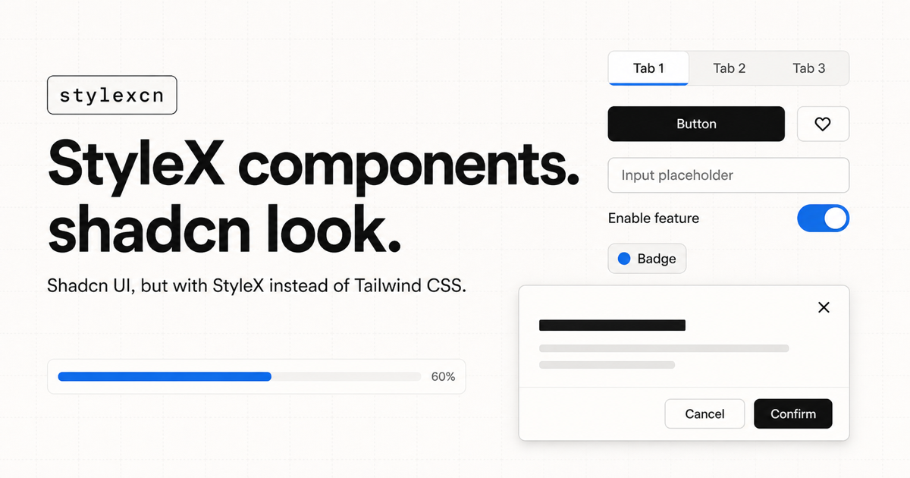

# stylexcn

Shadcn UI, but with StyleX instead of Tailwind CSS.



## Documentation

Visit https://stylexcn.vercel.app/docs to view the documentation.

## Usage

```bash
pnpm dlx shadcn@latest add https://stylexcn.vercel.app/r/button.json
```

After [registering the optional namespace](https://stylexcn.vercel.app/docs):

```bash
pnpm dlx shadcn@latest add @stylexcn/button
```

StyleX must already be set up.
See the [documentation](https://stylexcn.vercel.app/docs) for the rest.

## Dark mode

Install the optional dark theme:

```bash
pnpm dlx shadcn@latest add @stylexcn/theme
```

Apply the StyleX theme class and the `dark` class to the same ancestor:

```tsx
import * as stylex from '@stylexjs/stylex';
import { darkTheme } from '@/lib/theme.stylex';

const themeProps = stylex.props(darkTheme);

export function DarkSurface({ children }: { children: React.ReactNode }) {
  return (
    <div
      {...themeProps}
      className={`dark ${themeProps.className ?? ''}`}
    >
      {children}
    </div>
  );
}
```
